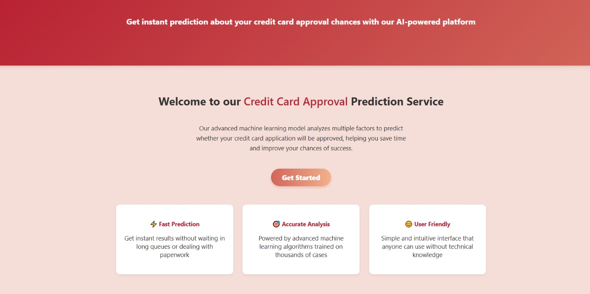
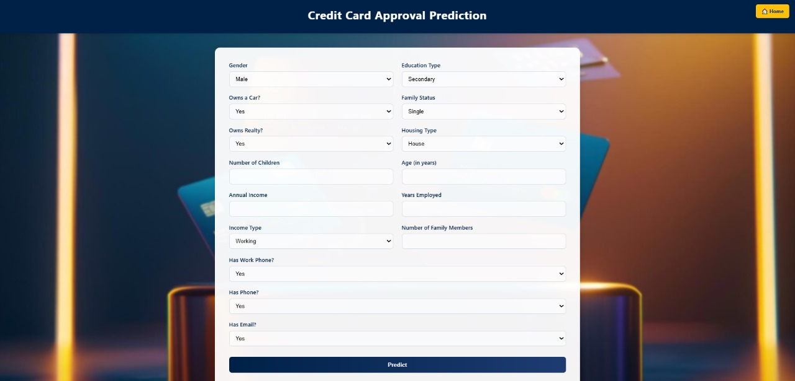

# Credit Card Approval Prediction System

This project is a machine learning-based web application that predicts the likelihood of credit card approval for a customer based on their personal and financial details. It leverages a Random Forest Classifier trained on historical credit and application records.

---

## 🔍 Project Overview

Many financial institutions face challenges in assessing credit card applications quickly and accurately. This project provides a predictive solution using machine learning to automate and improve this process.

The application offers:
- A user-friendly web interface (built using Flask)
- Real-time predictions
- Visual insights into model performance

---

## 📁 Directory Structure

```

├── Dataset/
│   ├── application\_record.csv
│   └── credit\_record.csv
│ 
├── Images/
│   ├── Decision Tree\_plot.png
│   ├── Logistic Regression\_plot.png
│   ├── Random Forest\_plot.png
│   ├── XGBoost\_plot.png
│   └── model\_comparison\_metrics.png
│ 
├── models/
│   ├── Random\_Forest\_best\_model.pkl
│   ├── best\_threshold.txt
│   └── train\_columns.pkl
│ 
├── notebooks/
│   ├── 1\_Visualizing\_and\_analyzing\_data.ipynb
│   ├── 2\_Data\_preprocessing.ipynb
│   ├── 3\_Model\_building.ipynb
│   └── 4\_Prediction.ipynb
│ 
├── static/
│   ├── credits-card.jpg
│   ├── landing_page.jpg
│   ├── input_page.png
│   ├── result_page.png
│ 
├── templates/
│   ├── landing\_page.html
│   ├── form.html
│   └── result.html
│ 
├── app.py
├── requirements.txt
├── LICENSE
├── .gitignore
└── README.md

````

## 🚀 How to Run the Project

1. **Clone the repository**  
   ```bash
   git clone https://github.com/your-username/credit-card-approval-prediction.git
   cd credit-card-approval-prediction


2. **Create a virtual environment** (optional but recommended)

   ```bash
   python -m venv venv
   source venv/bin/activate  # On Windows: venv\Scripts\activate
   ```

3. **Install dependencies**

   ```bash
   pip install -r requirements.txt
   ```

4. **Run the Flask app**

   ```bash
   python app.py
   ```

5. **Visit in browser:**
   Navigate to [http://127.0.0.1:5000](http://127.0.0.1:5000) to use the application.

---

## 🧠 Machine Learning Details

* **Model Used:** Random Forest Classifier
* **Evaluation Metrics:** Accuracy, F1 Score, Confusion Matrix
* **Preprocessing:** Handled using SMOTE, encoding, feature scaling
* **Threshold Selection:** Based on optimized F1 score

---

## 📊 Visualizations

Located in the `Images/` folder, these plots help analyze the performance of:

* Logistic Regression
* Decision Trees
* Random Forests
* XGBoost
* Model comparison metrics

---

## 🖥️ Web Interface Using Flask

* `landing_page.html`: Landing page with a call-to-action to initiate prediction
* `form.html`: Takes user inputs for prediction
* `result.html`: Displays prediction results and approval probability


## 🔥 Project Screenshots

### 🚀 Landing Page


### 🧾 Input Form


### ✅ Result Prediction


---

## 👨‍💻 Author

* **Uditya Narayan Tiwari** – [GitHub](https://github.com/udityamerit)

## 🤝 Collaborators

* **Kirti Pratihar** - [GitHub](https://github.com/KirtiPratihar)
* **Rutuja Kumbhar** - [GitHub](https://github.com/RutujaKumbhar17)
* **Pranjal** - [GitHub](https://github.com/PranjalMerit)

---

## 📄 License

This project is licensed under the MIT License. See the [LICENSE](LICENSE) file for more details.

---

## 📧 Connect with Me

**Uditya Narayan Tiwari**

🌐 [My Portfolio](https://udityanarayantiwari.netlify.app/)

💼 [My LinkedIn](https://www.linkedin.com/in/uditya-narayan-tiwari-562332289/)

👨‍💻 [My GitHub](https://github.com/udityamerit)

📧 [Email Id](uditmerit@gmail.com)


If you have any questions or suggestions, feel free to reach out via GitHub or email.
